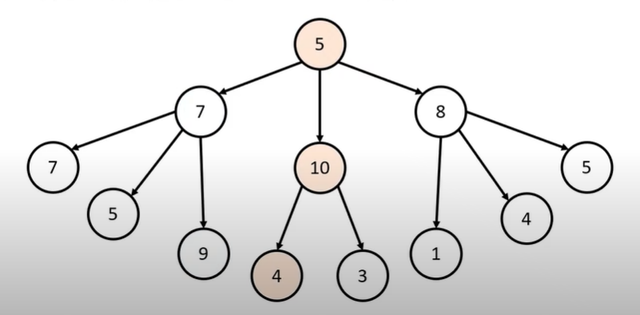
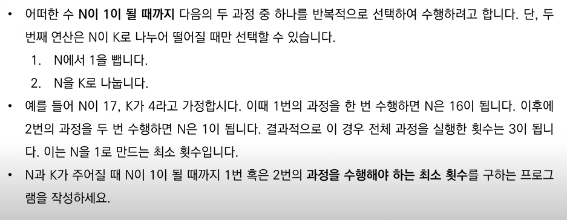
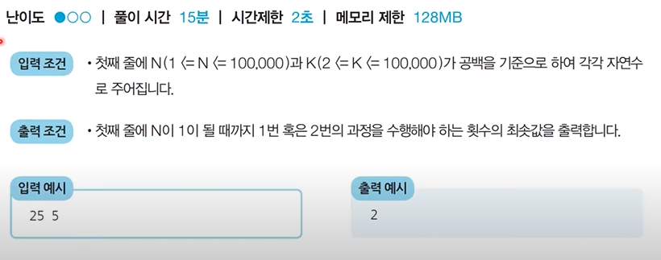
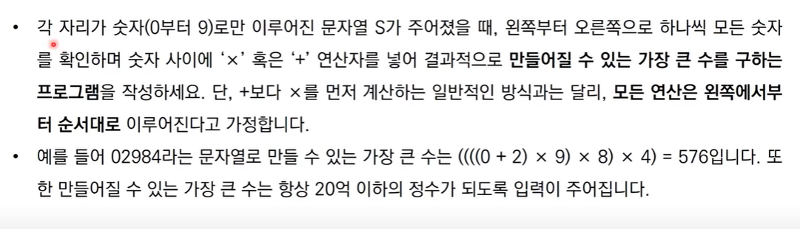
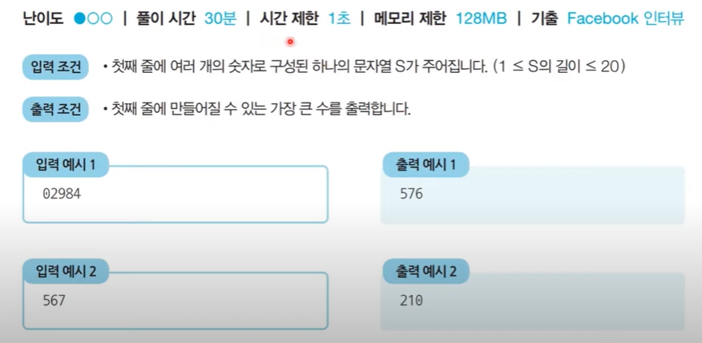
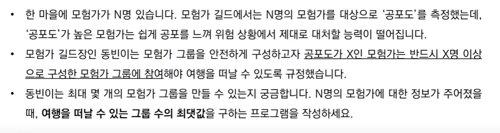
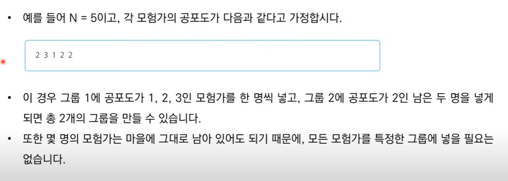
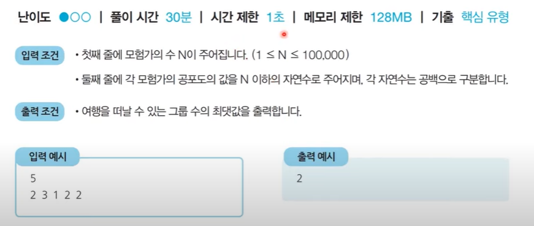

# Greedy Algorithm (그리디 알고리즘, 탐욕법)

- [Greedy Algorithm (그리디 알고리즘, 탐욕법)](#greedy-algorithm-그리디-알고리즘-탐욕법)
  - [개념](#개념)
    - [예시 문제 : 거스름 돈](#예시-문제--거스름-돈)
  - [문제](#문제)
    - [문제1 - 1이 될 때까지](#문제1---1이-될-때까지)
    - [문제2 - 곱하기 혹은 더하기](#문제2---곱하기-혹은-더하기)
    - [문제3 - 모험가 길드](#문제3---모험가-길드)

---

## 개념

> **정의**  
> 현재 상황에서 지금 당장 좋은 것만 고르는 방법을 의미한다

- 일반적으로 문제를 풀기 위한 최소한의 아이디어를 떠올릴 수 있는 능력 요구

- **정당성 분석** 중요!!  
  단순히 가장 좋아 보이는 것을 반족적으로 선택해도 최적의 해인지 검토해야함

  

  위와 같이 매 순간 최적의 루트로만 선택한 경로의 합은 19(5+10+4)이다.

  이는 5->7->9 (21) 의 경로 보다는 최적의 해가 아님

  즉, 일반적인 상황에서 그리디 알고리즘은 최적의 해를 보장하지는 않음

  따라서 정당성 분석이 중요하다

대부분의 코딩 테스트에서의 그리디 문제는 **그리디로 풀어도 최적의 해가 나오는지 추론하는 과정을 보는 문제**로 나옴

### 예시 문제 : 거스름 돈

정당성 분석이 중요한 이유를 거스름 돈 예제를 통해 더 자세히 이해해보자

> **문제 설명**  
> 당신은 음식점의 계산을 도와주는 점원입니다. 카운터에는 거스름돈으로 사용할 500원, 100원, 50원, 10원짜리 동전이 무한히 존재한다고 가정합니다. 손님에게 거슬러 주어야 할 돈이 n원일 때 거슬러 주어야 할 동전의 최소 개수를 구하세요. 단, 거슬러 줘야 할 돈 n은 항상 10의 배수입니다.

1.  **문제 해결 아이디어 떠올리기**  
    최적의 해를 빠르게 구하기 위해서는 **가장 큰 화폐 단위부터** 돈을 거슬러 준다.
2.  **정당성 분석하기**  
    가장 큰 화폐 단위부터 돈을 거슬러 주는 것이 최적의 해를 보장하는 이유는?  
    -> 가지고 있는 동전 중 큰 단위가 항상 작은 단위의 배수이므로 **작은 단위의 동전들을 종합하여 다른 해가 나올 수 없기** 때문임

    예를 들어 ,  
    화폐 단위가 500, 400, 100원이고 800원을 거슬러 주어야 한다면 위의 아이디어(탐욕법)으로 풀이가 안된다.  
    (500\*1+100\*3 : 4개 보다는 400\*2 : 2개가 최적의 해 )

    > 즉!! 그리디 알고리즘 문제에서는
    >
    > 1.  문제 풀이를 위한 최소한의 아이디어를 떠올리고
    > 2.  이것이 정당한지 검토할 수 있어야 한다.

3.  **풀이**
    <details>
    <summary>내 풀이/답안 예시</summary>
    <div markdown="1">
     내 풀이

    ```python
     my_money = (500,100,50,10)
     n = int(input("손님 돈: "))

     result = 0
     for i in my_money:
     result += n//i
     n = n%i
     if n%i == 0: break

     print("거스름돈:",result)
    ```

    답안 예시

    ```python
    n = 1260
    count = 0

    # 큰 단위의 화폐부터 차례대로 확인하기
    array = [500, 100, 50, 10]

    for coin in array:
        count += n // coin # 해당 화폐로 거슬러 줄 수 있는 동전의 개수 세기
        n%= coin

    print(count)
    ```

     </div>
     </details>

4.  **시간 복잡도 분석**  
    시간복잡도 : O(K)  
    (화폐의 종류가 K라고 할 때)

## 문제

### 문제1 - 1이 될 때까지

- 코드  
  basic_greedy_1.py

> **문제 설명**  
>  

### 문제2 - 곱하기 혹은 더하기

- 코드  
  basic_greedy_2.py

> **문제 설명**   
> **참고**  
> 기본적으로 프로그래밍 언어에서 int형은 21억의 수까지 계산O이므로 20억 이하의 정수 입력이 주어지는 것이 조건.
> 

### 문제3 - 모험가 길드

- 코드  
  basic_greedy_3.py

> **문제 설명**   
