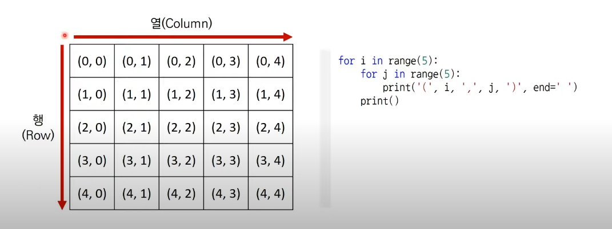
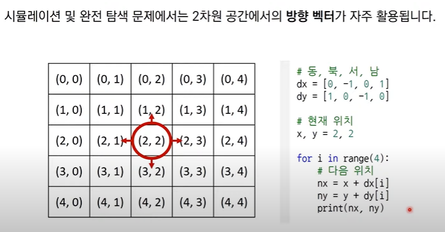
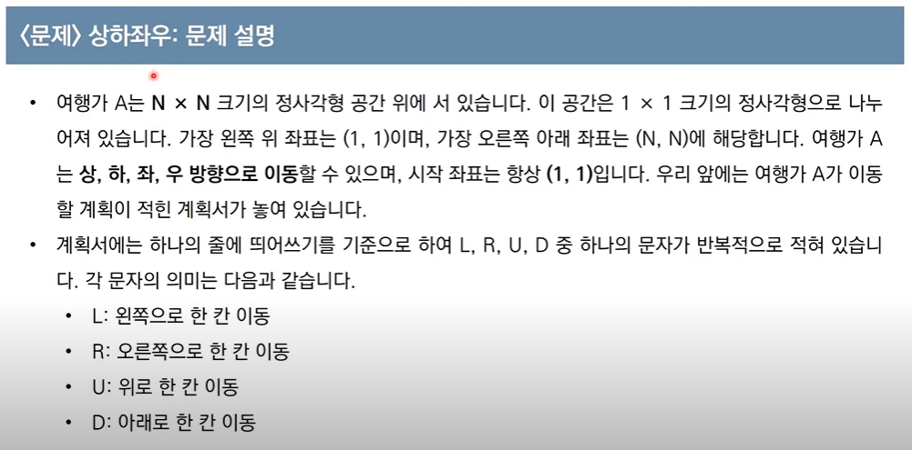
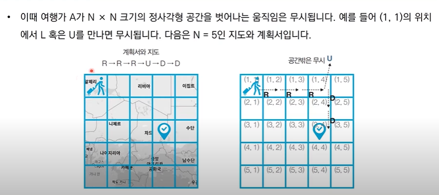
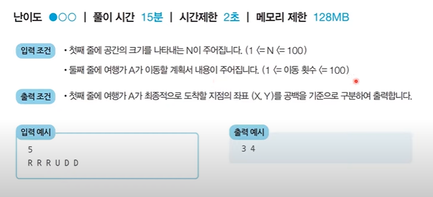
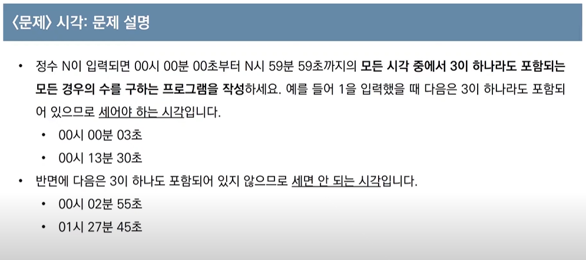
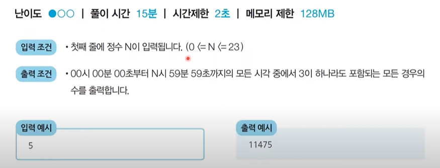

# 구현(Implementation) : 시뮬레이션과 완전 탐색

- [구현(Implementation) : 시뮬레이션과 완전 탐색](#구현implementation--시뮬레이션과-완전-탐색)
  - [개념](#개념)
    - [예시 문제](#예시-문제)
  - [문제](#문제)
    - [문제1 - 시각](#문제1---시각)

## 개념

구현 : 머릿속에 있는 알고리즘을 소스코드로 바꾸는 과정

- 흔히 알고리즘 대회에서 구현 유형의 문제는 **풀이를 떠올리는 것은 쉽지만 소스코드로 옮기기 어려운 문제**를 의미한다

**기본적인 구현 유형의 예시**  
사용 언어에 따라 구현 난이도가 달라지기도 함

- 알고리즘은 간단한데 코드가 지나칠 만큼 길어지는 문제
- 실수 연산을 다루고, 특정 소수점 자리까지 출력해야 하는 문제
- 문자열을 특정한 기준에 따라 끊어 처리해야 하는 문제 (파이썬의 강점)
- 적절한 라이브러리를 찾아서 사용해야 하는 문제

---

시뮬레이션과 완전탐색 중심으로 구현 유형 알아보자

**기본**  

기본적으로 시뮬레이션, 완전탐색 문제에서 2차원 공간 **행렬**(Matrix)를 자주 사용한다.

시뮬레이션 같은 경우
특정한 캐릭터/사물 등이 특정 위치에 존재했다가 상하좌우로 이동할 수 있다고 문제 정의되는 경우 많음  
-> 해결하기 위해 **방향벡터가 자주 사용**된다.

### 예시 문제

**문제 풀이**

대표적인 시뮬레이션 문제

**시뮬레이션**  
일련의 명령에 따라 개체를 차례대로 이동시키는 유형으로, 구현이 중요한 대표적인 문제 유형이다.

알고리즘 교재나 문제 풀이 사이트에 따라 다르게 일컬을 수 있음  
-> 시뮬레이션, 구현, 완전 탐색 유형은 서로 유사한 점이 많다는 정도로 기억하자

## 문제

### 문제1 - 시각

- 코드  
  basic_implementation_1.py

**문제 설명**

**문제 해결 아이디어**  
전형적인 **완전 탐색(Brute Forcing)** 문제 유형

하루 -> 86,400초 (24\*60\*60 따라서 00시 00분 00초 ~ 23시 59분 59초까지 경우의 수 86,400가지)

파이썬 -> 1초에 2천만번 연산 수행 가정하고 문제 풀면 합리적인 것 기억하고 풀면 좋다

결론: 단순히 시각을 1씩 증가시키면서 3이 하나라도 포함되어 있는지를 확인한다.  
=> 가능한 경우의 수를 모두 검사해보는 **완전 탐색(Brute Forcing)** 방법
